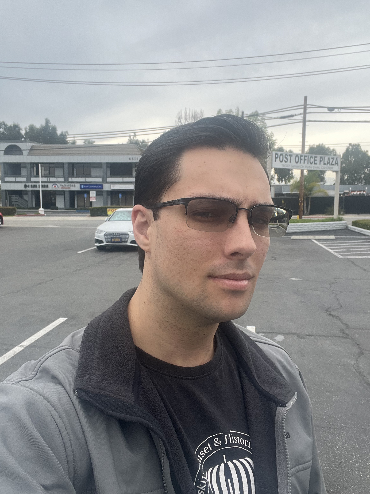

# Nick's Super Creative Github Page
## About me
Hi! My name is Nick and I'm a computer science student at UCSD. I don't know why I put that exclamation mark at the beginning, approximately *zero* computer science students in history maintain their happiness to this point. 

When I'm not banging my head against the screen in prayers that the segfault I just created will magically fix itself, I enjoy going to the gym, gaming (such as Slay the Spire 2), and thrifting. I also love spending time with my 3 cats
1. Boo
2. Bento
3. Bandit

I mainly program in **C++**, there's no particular reason for this other than I like the syntax as opposed to Java and don't want to trivialize coding by using python.
> Not dissing python, just personal moral code

```
from library import thing

thing.dothing()
```

## Toolstack
- Languages: Java, C/C++, C#, Python, Assembly 
- Frameworks/Tools: Git, Github, Bim, Vistual Studio Code, LaTeX, Powershell, KiCAD
- Networking/Cloud: Microsoft Azure, Entra ID, SonicWall, Datto
## Projects
I have one project in progress, a USB-C Macro pad using the ATMEGA32u4 microprocessor. I like staying low to the computer, so hardware projects like this are what I want to do more of. You can find it here: https://github.com/n3adams-stack/CRGBMacro

I will keep an updated tracker of this project so you can see what is completed and what needs to be done
- [x] Design Macropad
- [x] Put together parts list
- [x] Fabricate and order parts
- [ ] Assemble protoype pad
- [ ] Program pad
- [ ] Post results
## Other Platforms
I am on LeetCode and LinkedIN as well if that interests you. Links below:
http://www.linkedin.com/in/nick-adams-7aa769305
https://leetcode.com/u/Dr3dgenY0r/

# Section Links
Not that this page is large enough to justify them, but I do need to include them so here ya go!

[About me](#about-me).

[Toolstack](#toolstack).

[Projects](#projects).

[Other Platforms](#other-platforms).
